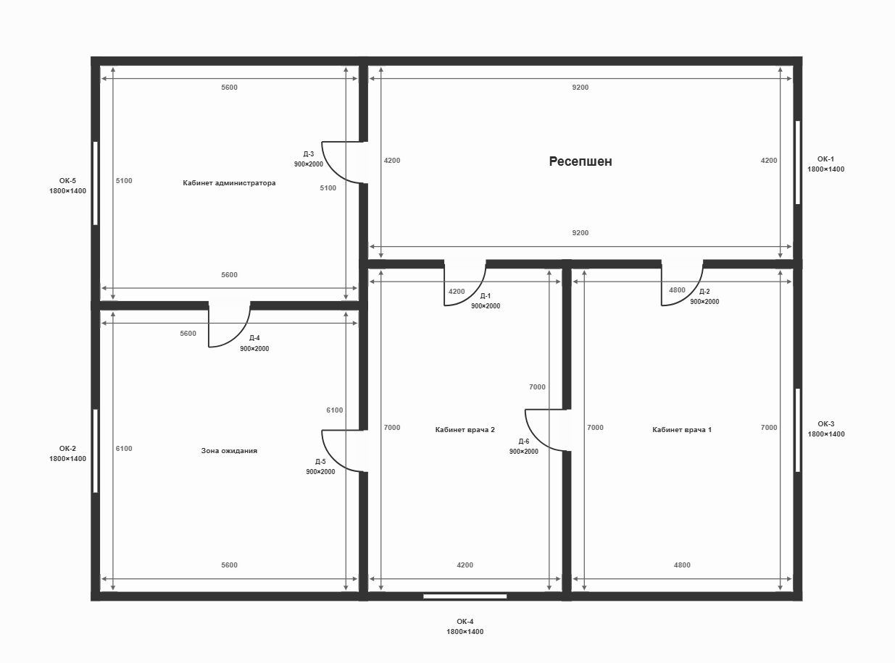
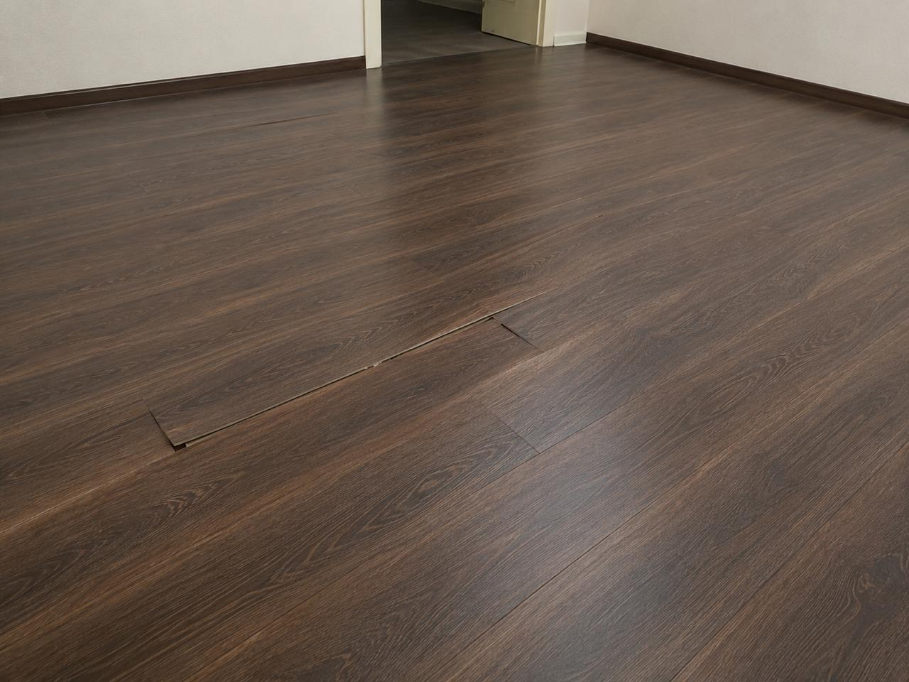
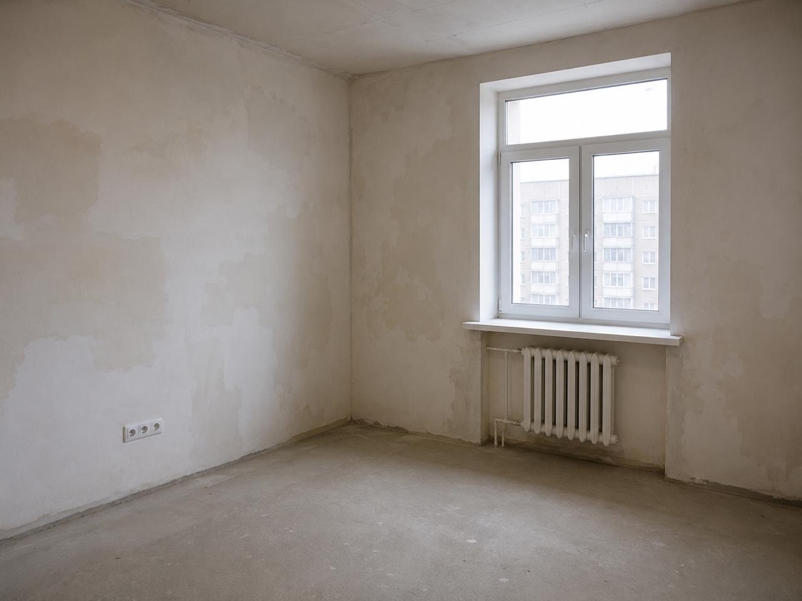
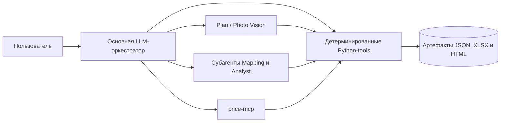

# Construction Audit MVP for Ouroboros

`construction_audit_mvp` — расширение для [Ouroboros](https://github.com/razzant/Ouroboros), которое проводит предварительную автоматизированную проверку строительной сметы по плану объекта и, при наличии, фотографиям площадки.

Скилл решает две задачи:

- **план + XLSX-смета** — проверяет контрольные объёмы и стоимость, отмечает расхождения, предлагает анализ 1–5 фотографий, формирует автономный HTML-отчёт и в конце предлагает создать эталонную (контрольную) XLSX-смету;
- **только план** — после подтверждения распознанной геометрии формирует предварительную XLSX-смету по внешнему каталогу цен.

Это не замена строительной экспертизе. Результат является предварительным автоматизированным аудитом и требует проверки специалистом.

## Зачем это нужно

Обычная LLM может распознать план и понять названия работ, но ей нельзя без проверки доверять арифметику, цены и происхождение данных. Поэтому скилл разделяет обязанности:

- Vision-субагент извлекает видимую геометрию плана;
- пользователь проверяет, исправляет и отдельно подтверждает геометрию;
- Mapping-субагент подключается только для неоднозначных смысловых соответствий;
- Python-код проверяет схемы, состояние процесса и единицы измерения, считает через `Decimal`, сохраняет SHA-256 и трассировку расчётов;
- внешний MCP-сервер возвращает поддерживаемые виды работ и эталонные цены;
- аналитический субагент формулирует только гипотезы со ссылками на уже сохранённые доказательства.

## Основные возможности

- импорт одного плана (`PNG`, `JPG` или `JPEG`) и необязательной XLSX-сметы;
- обязательная проверка геометрии с неограниченным числом пользовательских ревизий;
- проверка грунтовки и окраски стен, пола, потолка, плинтуса, дверей и окон;
- раздельная проверка объёмов, единичных цен и стоимости;
- явный учёт неподдерживаемых или непроверенных строк;
- необязательный анализ ZIP-архива с 1–5 фотографиями;
- автономный HTML-отчёт и предложение сформировать эталонную (контрольную) XLSX-смету из подтверждённой геометрии и цен MCP;
- воспроизводимые промежуточные JSON-артефакты и данные об их происхождении.

## Реальный demo-кейс

> [▶ Открыть пошаговую демонстрацию на GitHub Pages](https://michaeldavislol.github.io/construction_audit_mvp/demo/)
>
> Два реальных запуска с короткими видео: действия пользователя, вызовы tools,
> изолированные субагенты, MCP-каталог, проверки и готовые артефакты — с пояснением
> архитектуры, этапов и проверяемых результатов.

В [`examples/medical-office`](examples/medical-office/README.md) сохранён обезличенный end-to-end запуск от 17–18 июля 2026 года:

- план медицинского офиса и XLSX-смета на 35 строк;
- две фотографии объекта;
- подтверждённая геометрия, ревизия 2;
- 100% полнота проверки количества и цены;
- 6 предварительных расхождений: 2 высокой важности и 4 предупреждения;
- 16 наблюдений по фотографиям и 4 проверяемые аналитические гипотезы;
- полный набор из 18 выходных артефактов, включая [`report.html`](https://michaeldavislol.github.io/construction_audit_mvp/examples/medical-office/output/report.html), [`generated_estimate.xlsx`](examples/medical-office/output/generated_estimate.xlsx), трассировку расчётов, сопоставление строк, расхождения и результаты модельных этапов.



| Фото 1: видимый дефект стыка пола | Фото 2: помещение до финишной отделки |
|---|---|
|  |  |

В [`examples/plan-only-review`](examples/plan-only-review/README.md) зафиксирован второй реальный запуск без исходной XLSX. Скилл распознал пять помещений, указал на отсутствующую высоту, принял явное пользовательское исправление `2,8 м`, создал и подтвердил ревизию геометрии 2, получил каталог MCP и сформировал предварительную XLSX на 31 строку без пропусков.

Дополнительный набор [`examples/stability-evidence`](examples/stability-evidence/README.md) содержит десять независимых реальных запусков в едином формате «вход → полный набор результатов». Сценарии версии `0.7.7` охватывают намеренные ошибки в смете, намеренно подтверждённую неверную геометрию, корректную смету без ложных расхождений, работу только с планом, отсутствующую дверную работу, смысловое сопоставление, контролируемую остановку при недоступном MCP, расчёт по явно введённым размерам и независимое распознавание помещения, удалённого из XLSX. Во всех семи завершённых аудитах с исходной XLSX полнота проверки количества и цены составила 100%; два сценария только с планом сформировали расчётные XLSX, а MCP-кейс намеренно остановился до начала аудита.

В ветке аудита с готовой сметой генерация контрольной XLSX является отдельным финальным действием: после отчёта скилл предлагает собрать эталонную смету по подтверждённому плану и каталогу MCP. Файл создаётся только после явного согласия пользователя и позволяет сопоставить исходную смету с независимо рассчитанным вариантом.

Демонстрационные артефакты получены версиями `0.7.5` и `0.7.6`; публикуемый пакет скилла обновлён до `0.7.7`. Историческая версия каждого запуска указана рядом с примером.

## Архитектура



LLM используется там, где нужны зрение и смысл. Python является доверенной расчётной границей, а MCP — явным внешним источником каталога цен.

## Обязательный MCP-сервер

На **том же компьютере**, где запущен Ouroboros, должен работать отдельный процесс `price-mcp`. Его исходники включены в этот репозиторий в [`mcp/price-mcp`](mcp/price-mcp/README.md):

```text
http://127.0.0.1:8888/mcp
```

В настройках Ouroboros серверу необходимо задать ID `construction_prices`. Тогда инструмент будет доступен под ожидаемым скиллом именем:

```text
mcp_construction_prices__get_supported_works
```

Без этого инструмента скилл намеренно останавливается: он не подставляет цены из памяти модели и не продолжает аудит с непроверенным каталогом. См. [настройку MCP](docs/MCP_SETUP.md).

## Быстрый старт

1. Установить и запустить включённый `price-mcp` на этом же ПК:

   ```bash
   cd mcp/price-mcp
   uv sync
   uv run python server.py
   ```

2. Скопировать содержимое каталога `skill/` в:

   ```text
   <OUROBOROS_HOME>/data/skills/external/construction_audit_mvp/
   ```

3. В Ouroboros открыть **Settings → Advanced → MCP Servers**, включить MCP-клиент и добавить сервер из примера выше.
4. Открыть **Skills → My skills**, выполнить проверку скилла, выдать необходимые разрешения и включить его.
5. Начать новый диалог и загрузить план либо план вместе с XLSX-сметой.

Полная последовательность и команды: [INSTALL.md](INSTALL.md).

## Структура репозитория

```text
.
├── README.md
├── INSTALL.md
├── index.html
├── docs/
│   ├── GLOSSARY.md
│   ├── MCP_SETUP.md
│   ├── TECHNICAL.md
│   └── USER_GUIDE.md
├── demo/
│   ├── index.html
│   ├── app.js
│   ├── styles.css
│   └── media/
├── examples/
│   ├── medical-office/
│   ├── plan-only-review/
│   └── stability-evidence/
├── mcp/
│   └── price-mcp/
├── tests/
│   ├── README.md
│   ├── _mvp_fixtures.py
│   ├── test_mvp_workflow.py
│   ├── test_mvp_geometry.py
│   ├── test_mvp_calculations.py
│   ├── test_mvp_prices.py
│   ├── test_mvp_visual.py
│   └── ...
└── skill/
    ├── SKILL.md
    ├── plugin.py
    ├── core.py
    ├── vision.py
    ├── visual.py
    ├── insights.py
    └── report.py
```

Каталог `skill/` является устанавливаемым пакетом. Документация репозитория намеренно хранится отдельно и не попадает в рабочий каталог скилла.

## Тесты

В наборе 166 проверок: быстрые модульные тесты формул и валидации, тесты публичных
tools и один короткий сквозной сценарий до готового HTML. На текущей версии все
они проходят примерно за полторы секунды. Покрытие инструкций основных Python-модулей
составляет около 87%; минимальный порог в репозитории — 80%.

Тесты покрывают весь детерминированный контур скилла. Ответы LLM представлены
фиксированными контрактными примерами, поэтому покрытие относится к Python-коду,
а не к качеству распознавания или рассуждений модели.

```bash
python -m pip install -r requirements-test.txt
python -m coverage run -m pytest
python -m coverage report
```

Подробная карта набора и объяснение границ находится в [`tests/README.md`](tests/README.md).

## Документация

- [Установка в Ouroboros](INSTALL.md)
- [Настройка и запуск price-mcp](docs/MCP_SETUP.md)
- [Руководство пользователя](docs/USER_GUIDE.md)
- [Техническая документация](docs/TECHNICAL.md)
- [Словарь терминов](docs/GLOSSARY.md)

## Ограничения MVP

- одновременно обрабатывается один план;
- фотографии принимаются одним ZIP-архивом, от 1 до 5 файлов;
- фото дают наблюдения, но не доказывают объёмы выполненных работ;
- отсутствующие размеры не заменяются «типовыми» значениями;
- поддержка работ ограничена перечнем выше и текущим каталогом MCP;
- скилл не утверждает нарушение, умысел или завышение подрядчиком.

## Планируемые доработки

Дальнейшее развитие проекта предусматривает:

- поддержку многостраничных PDF, нескольких планов одного объекта и дополнительных форматов XLSX;
- сравнение версий смет и привязку фотографий к помещениям и строкам работ;
- расширение перечня работ: штукатурка, шпаклёвка, плиточные работы и перегородки;
- восстановление прерванных запусков и повтор отдельных этапов без полного пересчёта;
- развитие каталога цен: регионы, даты действия, версии и история изменений;
- добавление ролей пользователей, журнала действий, мониторинга и резервного копирования;
- внедрение версионирования артефактов и автоматических проверок перед релизом.

Новые виды работ будут реализовываться отдельными расчётными модулями с проверяемыми формулами, правилами единиц измерения и тестовыми сценариями.

## Версия и лицензия

Текущая версия пакета скилла: `0.7.7`.

Проект распространяется по лицензии [MIT](LICENSE). Copyright © 2026 MichaelDavis.
