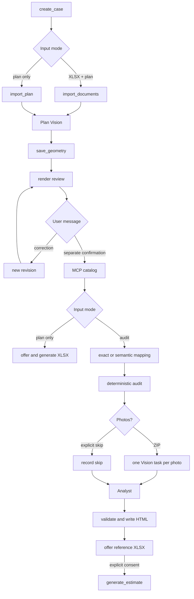

# Техническая документация

## Назначение и версия

`construction_audit_mvp` — Ouroboros extension skill версии `0.7.7`. Runtime entry point — `plugin.py`; единственная внешняя Python dependency — `openpyxl`.

Manifest запрашивает permissions `tool` и `fs`, timeout каждого зарегистрированного tool — 30 секунд.

## Компоненты

| Файл | Ответственность |
|---|---|
| `SKILL.md` | строгий orchestration contract для основной модели |
| `plugin.py` | JSON Schema и регистрация 14 публичных tools |
| `core.py` | state machine, импорт, каталог, mapping, расчёты, артефакты |
| `vision.py` | валидация и нормализация geometry |
| `visual.py` | packets и валидация анализа фотографий |
| `insights.py` | analyst context и валидация гипотез |
| `report.py` | генерация автономного HTML |

Основная модель оркестрирует workflow, но не создаёт geometry, mapping, findings или цены и не выполняет итоговую арифметику.

## Внешние runtime-возможности

Кроме tools скилла используются:

- `schedule_subagent` и `wait_task` для A2A-делегаций;
- `view_image` внутри Vision-задач;
- `mcp_construction_prices__get_supported_works` для каталога цен.

Субагенты:

| Задача | Lane | Назначение |
|---|---|---|
| Plan Vision | `main` | извлечь видимую geometry одного плана |
| Mapping | `light` | разрешить неточные смысловые соответствия |
| Photo Vision | `main` | описать наблюдения одного фото |
| Analyst | `main` | сформулировать гипотезы по сохранённым фактам |

Exact mapping выполняется deterministic Python-кодом без отдельного Mapping-субагента.

## Публичные tools

1. `create_case`
2. `import_documents`
3. `import_plan`
4. `save_geometry`
5. `confirm_geometry`
6. `render_geometry_review`
7. `save_price_catalog`
8. `generate_estimate`
9. `run_audit`
10. `skip_visual_review`
11. `import_site_photos`
12. `save_visual_analysis`
13. `finalize_audit`
14. `render_audit_summary`

Аргументы и ограничения являются частью JSON Schema в `plugin.py`; детальный порядок вызовов — в `SKILL.md`.

## Workflow

Geometry correction инвалидирует подтверждение, каталог и все downstream audit/XLSX-артефакты. После correction необходимы новый review, отдельное подтверждение и новый каталог MCP.

## State и файлы

Корень job создаётся через `api.skill_job_dir(job_id)` и содержит `assets/`, `output/`, `tmp/` и `manifest.json`. Пользовательский `job_id` ограничен шаблоном `[A-Za-z0-9_-]{1,64}`; физическое имя каталога контролирует Ouroboros.

Основные output-файлы:

| Файл | Содержимое |
|---|---|
| `estimate_normalized.json` | нормализованные строки XLSX |
| `geometry.json` | текущая canonical geometry |
| `geometry_review.json` | источник review |
| `geometry_corrections.json` | история revisions и исправлений |
| `price_catalog.json` | валидированный ответ MCP |
| `mapping.json` | validated mapping schema v3 |
| `quantities.json` | контрольные количества |
| `calculation_trace.json` | формулы, inputs и результаты |
| `price_checks.json` | проверки стоимости |
| `findings.json` | findings, warnings и coverage |
| `visual_*.json` | состояние photo workflow |
| `llm_context.json` | зафиксированный analyst context |
| `llm_insights.json` | валидированные гипотезы |
| `report.html` | автономный отчёт |
| `generated_estimate.xlsx` | необязательная эталонная (контрольная) смета по подтверждённой geometry и ценам MCP |

Записи критичных JSON/HTML выполняются атомарно; входные копии и важные payloads фиксируются SHA-256. Plan/photo projections создаются в runtime uploads-каталоге под content-addressed именами.

## Расчётная граница

Python-код:

- валидирует точные наборы полей, типы, диапазоны и IDs;
- проверяет совместимость единиц;
- использует `Decimal` и контролируемое округление;
- считает площади пола/потолка, валовую и чистую площадь стен, длину плинтуса и уникальные проёмы;
- отделяет quantity difference, unit-price difference и итоговую cost difference;
- сохраняет coverage и причины пропуска.

Недостающие размеры не заменяются defaults. Отключается только зависимая метрика.

## Безопасность и fail-closed поведение

- файлы принимаются только как staged manifest entries;
- проверяются расширение, сигнатура, размер, symlink и SHA-256 копии;
- ZIP ограничен 1–5 поддерживаемыми изображениями и извлекается под контролируемые имена;
- ответы субагентов проходят строгую schema validation;
- stale geometry revision отклоняется;
- конфликт размеров общего дверного проёма блокирует подтверждение и расчёт;
- недоступный MCP блокирует Mapping, аудит и генерацию сметы;
- отчёт экранирует пользовательские и модельные строки;
- неожиданные exception details и локальные пути не возвращаются в tool result.

## Проверка перед релизом

Минимальный release checklist:

1. Убедиться, что версия в `SKILL.md` и `core.SKILL_VERSION` совпадает.
2. Выполнить `python -m compileall skill`.
3. Запустить Ouroboros skill preflight.
4. Выполнить полный tri-model review и сохранить clean executable verdict.
5. Проверить обе ветки: plan-only и XLSX + plan.
6. Проверить exact mapping и ветку semantic Mapping.
7. Проверить explicit photo skip и ZIP с несколькими фото.
8. Проверить недоступный/невалидный MCP и отсутствие скрытых defaults.
9. Убедиться, что в payload нет `.ouroboros_env`, кэшей, тестовых jobs, пользовательских файлов и секретов.
