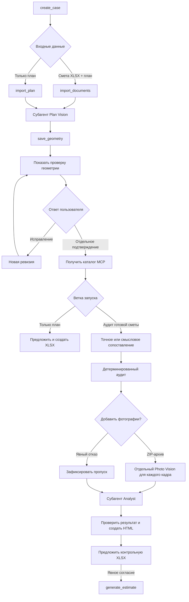

# Техническая документация

## Назначение и версия

`construction_audit_mvp` — внешний extension-скилл Ouroboros версии `0.7.7`. Точка входа среды выполнения — `plugin.py`; единственная внешняя Python-зависимость — `openpyxl`.

Манифест запрашивает разрешения `tool` и `fs`; предельное время работы каждого зарегистрированного tool — 30 секунд.

## Компоненты

| Файл | Ответственность |
|---|---|
| `SKILL.md` | строгий контракт управления процессом для основной модели |
| `plugin.py` | JSON Schema и регистрация 14 публичных tools |
| `core.py` | машина состояний, импорт, каталог, сопоставление, расчёты, артефакты |
| `vision.py` | проверка и нормализация геометрии |
| `visual.py` | пакеты заданий и проверка анализа фотографий |
| `insights.py` | контекст Analyst и проверка гипотез |
| `report.py` | генерация автономного HTML |

Основная модель управляет порядком работы, но не создаёт геометрию, сопоставление, найденные расхождения или цены и не выполняет итоговую арифметику.

## Внешние возможности среды выполнения

Кроме tools скилла используются:

- `schedule_subagent` и `wait_task` для A2A-делегаций;
- `view_image` внутри Vision-задач;
- `mcp_construction_prices__get_supported_works` для каталога цен.

Субагенты:

| Задача | Класс модели | Назначение |
|---|---|---|
| Plan Vision | `main` | извлечь видимую геометрию одного плана |
| Mapping | `light` | разрешить неточные смысловые соответствия |
| Photo Vision | `main` | описать наблюдения одного фото |
| Analyst | `main` | сформулировать гипотезы по сохранённым фактам |

Точное сопоставление выполняется детерминированным Python-кодом без отдельного Mapping-субагента.

## Публичные tools

Tool здесь — не отдельная нейросеть, а Python-функция с фиксированной JSON-схемой. Основная LLM выбирает разрешённый следующий tool и передаёт ему структурированные аргументы. Tool проверяет состояние запуска и входные данные, выполняет детерминированную операцию, сохраняет результат и возвращает JSON со следующим действием. Если предварительные условия не выполнены, процесс останавливается с понятной ошибкой.

Plan Vision, Mapping, Photo Vision и Analyst не входят в эти 14 tools: это изолированные LLM-субагенты. Tools готовят для них ограниченный пакет данных и проверяют ответ перед сохранением.

### Создание запуска и импорт

- **`create_case(job_id, object_name)`** создаёт отдельный запуск с манифестом и каталогами для входных, временных и выходных данных. Используется первым, чтобы состояния разных аудитов не смешивались.
- **`import_documents(job_id, estimate, plan)`** проверяет XLSX и план, сохраняет безопасные копии и преобразует строки Excel в структурированный JSON. Используется для аудита готовой сметы и возвращает пакет задания для Plan Vision.
- **`import_plan(job_id, plan)`** проверяет и сохраняет только план, не создавая фиктивную исходную смету. Используется, когда новую смету требуется сформировать по плану.

### Геометрия и подтверждение пользователя

- **`save_geometry(job_id, vision_task_id, analysis)`** принимает JSON от Plan Vision, проверяет ID, помещения, размеры, двери и окна, затем создаёт новую ревизию геометрии. Основная LLM не может самостоятельно составить или вручную исправить этот ответ.
- **`render_geometry_review(job_id, geometry_revision)`** формирует полную таблицу помещений, размеров, высот, дверей, окон и недостающих данных. Без этого обзора геометрию нельзя подтверждать.
- **`confirm_geometry(job_id, geometry_revision, confirmed, corrections?, user_statement?)`** подтверждает текущую ревизию либо применяет явные исправления пользователя и создаёт следующую. Любое исправление аннулирует зависимые результаты и требует нового обзора.

### Каталог цен, расчёты и смета

- **`save_price_catalog(job_id, catalog_response)`** проверяет неизменённый ответ `mcp_construction_prices__get_supported_works`, включая работы, единицы, цены и происхождение данных. Вызывается только после подтверждения геометрии; LLM не извлекает цены из собственной памяти.
- **`run_audit(job_id, mapping_task_id, mapping, tolerance_percent=5)`** принимает проверенное сопоставление строк и допустимое отклонение. В Python рассчитывает пол, потолок, стены с вычетом проёмов, плинтус с вычетом дверей и уникальные проёмы, затем сравнивает объёмы и цены с XLSX и сохраняет расхождения, полноту проверки и трассировку формул.
- **`generate_estimate(job_id)`** по подтверждённой геометрии и сохранённым ценам MCP детерминированно создаёт XLSX и JSON. Вызывается только после отдельного согласия пользователя: в сценарии только с планом либо после готового аудита для контрольной сметы.

### Фотографии

- **`skip_visual_review(job_id)`** фиксирует явный ответ пользователя «без фото» и возвращает пакет задания для Analyst. Пропуск не учитывается как выполненная фотопроверка.
- **`import_site_photos(job_id, archive)`** проверяет и распаковывает ZIP с 1–5 изображениями. Для каждого кадра создаёт отдельный неизменяемый пакет Photo Vision с допустимыми работами и связанными строками сметы.
- **`save_visual_analysis(job_id, photo_id, photo_task_id, analysis)`** проверяет ответ Photo Vision для одного кадра и сохраняет различимые наблюдения по работам. После последнего кадра возвращает пакет задания для Analyst; при ошибке повторяется только этап, не прошедший проверку.

### Завершение аудита

- **`finalize_audit(job_id, insights_task_id, llm_insights)`** проверяет гипотезы Analyst, хранит их отдельно от детерминированных расхождений и формирует автономный `report.html`. Основная LLM не может вручную изменять ответ Analyst.
- **`render_audit_summary(job_id)`** возвращает сохранённую итоговую сводку либо пакет незавершённого этапа Analyst. Используется после завершения и при восстановлении прерванного хода, чтобы не пересобирать результат из истории чата.

Точные типы, обязательные поля, диапазоны и ограничения заданы в JSON-схеме каждого tool в [`plugin.py`](../skill/plugin.py). Разрешённый порядок вызовов и границы передачи результатов описаны в [`SKILL.md`](../skill/SKILL.md).

## Порядок работы

Исправление геометрии аннулирует подтверждение, каталог цен и все последующие артефакты аудита и XLSX. После исправления необходимы новая проверка геометрии, отдельное подтверждение пользователя и новый каталог MCP.

## Состояние и файлы

Корень запуска создаётся через `api.skill_job_dir(job_id)` и содержит `assets/`, `output/`, `tmp/` и `manifest.json`. Пользовательский `job_id` ограничен шаблоном `[A-Za-z0-9_-]{1,64}`; физическое имя каталога контролирует Ouroboros.

Основные выходные файлы:

| Файл | Содержимое |
|---|---|
| `estimate_normalized.json` | нормализованные строки XLSX |
| `geometry.json` | текущая каноническая геометрия |
| `geometry_review.json` | источник обзора геометрии |
| `geometry_corrections.json` | история ревизий и исправлений |
| `price_catalog.json` | проверенный ответ MCP |
| `mapping.json` | проверенная схема сопоставления v3 |
| `quantities.json` | контрольные количества |
| `calculation_trace.json` | формулы, входные данные и результаты |
| `price_checks.json` | проверки стоимости |
| `findings.json` | расхождения, предупреждения и полнота проверки |
| `visual_*.json` | состояние анализа фотографий |
| `llm_context.json` | зафиксированный контекст Analyst |
| `llm_insights.json` | проверенные гипотезы |
| `report.html` | автономный отчёт |
| `generated_estimate.xlsx` | необязательная эталонная (контрольная) смета по подтверждённой геометрии и ценам MCP |

Записи критичных JSON/HTML выполняются атомарно; входные копии и важные пакеты фиксируются SHA-256. Представления планов и фотографий создаются в каталоге загрузок среды выполнения под именами, зависящими от содержимого.

## Расчётная граница

Python-код:

- проверяет точные наборы полей, типы, диапазоны и идентификаторы;
- проверяет совместимость единиц;
- использует `Decimal` и контролируемое округление;
- считает площади пола/потолка, валовую и чистую площадь стен, длину плинтуса и уникальные проёмы;
- отделяет разницу количества, разницу единичной цены и итоговую разницу стоимости;
- сохраняет полноту проверки и причины пропуска.

Недостающие размеры не заменяются значениями по умолчанию. Отключается только зависимая метрика.

## Безопасность и контролируемая остановка

- файлы принимаются только как подготовленные записи манифеста;
- проверяются расширение, сигнатура, размер, символические ссылки и SHA-256 копии;
- ZIP ограничен 1–5 поддерживаемыми изображениями и извлекается под контролируемые имена;
- ответы субагентов проходят строгую проверку по схеме;
- устаревшая ревизия геометрии отклоняется;
- конфликт размеров общего дверного проёма блокирует подтверждение и расчёт;
- недоступный MCP блокирует Mapping, аудит и генерацию сметы;
- отчёт экранирует пользовательские и модельные строки;
- сведения о неожиданных исключениях и локальные пути не возвращаются в результате tool.

## Проверка перед релизом

Минимальный перечень проверок перед выпуском:

1. Убедиться, что версия в `SKILL.md` и `core.SKILL_VERSION` совпадает.
2. Выполнить `python -m compileall skill`.
3. Запустить предварительную проверку скилла в Ouroboros.
4. Выполнить полную проверку тремя моделями и сохранить положительное заключение о возможности запуска.
5. Проверить обе ветки: только план и XLSX + план.
6. Проверить точное сопоставление и ветку смыслового Mapping.
7. Проверить явный отказ от фотографий и ZIP с несколькими фото.
8. Проверить недоступный или некорректный MCP и отсутствие скрытых значений по умолчанию.
9. Убедиться, что в пакете нет `.ouroboros_env`, кэшей, тестовых запусков, пользовательских файлов и секретов.
