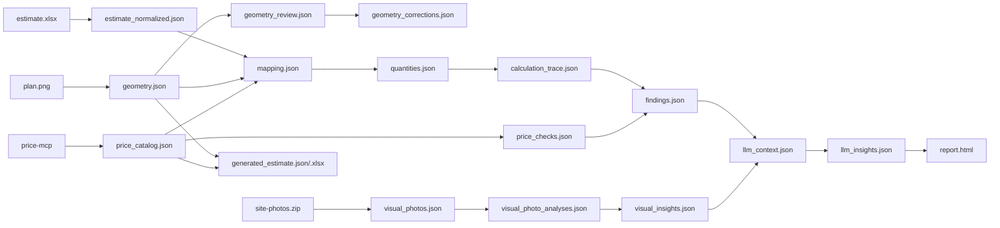

# Артефакты полного аудита

Каталог `output/` воспроизводит полный набор файлов завершённого job. Файлы расположены не только как иллюстрации: вместе они показывают цепочку происхождения данных от импорта до отчёта.

| Файл | Этап | Назначение |
|---|---|---|
| `estimate_normalized.json` | импорт XLSX | Нормализованные строки сметы, помещения, работы и warnings |
| `geometry.json` | Plan Vision + проверка | Каноническая геометрия версии 2 с источниками измерений |
| `geometry_review.json` | проверка геометрии | Структурированный источник пользовательской проверки |
| `geometry_corrections.json` | исправление пользователя | История изменения высоты помещений и перехода к версии 2 |
| `price_catalog.json` | MCP | Валидированный каталог из семи работ и цен |
| `mapping.json` | Mapping | Соответствия помещений, работ и MCP IDs, schema v3 |
| `quantities.json` | детерминированная проверка | Контрольные количества по помещениям и объекту |
| `calculation_trace.json` | детерминированная проверка | Формулы, исходные и округлённые результаты, ID трассировки |
| `price_checks.json` | детерминированная проверка | Раздельные проверки единичных цен и стоимости |
| `findings.json` | детерминированная проверка | Расхождения, предупреждения, полнота проверки и итоговая сводка |
| `visual_photos.json` | импорт фотографий | Список двух фотографий и состояние их анализа |
| `visual_photo_analyses.json` | Photo Vision | Результаты отдельных Vision-задач по двум фотографиям |
| `visual_insights.json` | photo aggregation | 16 валидированных наблюдений по фотографиям |
| `llm_context.json` | analyst preparation | Компактный зафиксированный контекст аналитического субагента |
| `llm_insights.json` | Analyst | Четыре валидированные гипотезы со ссылками на evidence |
| `report.html` | finalization | Автономный пользовательский HTML-отчёт |
| `generated_estimate.json` | контрольная смета | 31 строка, происхождение данных и учёт пропущенных позиций |
| `generated_estimate.xlsx` | optional estimate | Сформированная контрольная XLSX-смета |

## Цепочка данных

