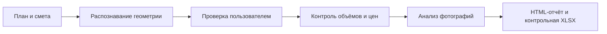

<strong>ПЛАН → СМЕТА → ФОТОГРАФИИ → ПРОВЕРЯЕМЫЙ ОТЧЁТ</strong>

<h1>Полный аудит медицинского офиса</h1>

Фактический сквозной запуск Construction Audit MVP на подготовленном обезличенном наборе данных: план пяти помещений, XLSX-смета на 35 строк и две фотографии объекта.

В демонстрационную смету намеренно внесены расхождения, чтобы показать полный цикл проверки — от подтверждения геометрии до расчётов, фотоанализа и контрольной сметы.

<a href="https://michaeldavislol.github.io/construction_audit_mvp/demo/#audit-flow"><strong>▶ Посмотреть пошаговую демонстрацию</strong></a> · <a href="https://michaeldavislol.github.io/construction_audit_mvp/examples/medical-office/output/report.html"><strong>📄 Открыть готовый отчёт</strong></a> · <a href="output/generated_estimate.xlsx"><strong>📊 Скачать контрольную XLSX</strong></a>

| **35 из 35** строк проверено | **100%** покрытие объёмов | **100%** покрытие цен | **6** предварительных замечаний |
|:---:|:---:|:---:|:---:|
| 5 помещений | 164,36 м² | 2 высокой важности | 4 предупреждения |

> **Главное за минуту.** Система независимо пересчитала объёмы по подтверждённому плану, сопоставила все строки сметы с контрольными работами и ценами, обнаружила возможное повторное включение окна, расхождения объёмов и цен, а по фотографии отметила видимый дефект стыка напольного покрытия. Каждый числовой вывод связан с формулой и исходными данными.

## Что обнаружено

Шесть системных замечаний относятся к пяти проверяемым эпизодам: возможный дубликат окна одновременно подтверждается отдельной проверкой количества.

| Приоритет | Помещение и работа | Смета | Контроль | Результат |
|---|---|---:|---:|---:|
| 🔴 Высокий | Кабинет врача 2 · установка окон | 2 шт. | 1 шт. | возможный дубликат; отклонение 100% |
| 🟠 Проверить | Зона ожидания · грунтовка стен | 64,75 м² | 59,4 м² | +9% |
| 🟠 Проверить | Кабинет врача 2 · монтаж плинтуса | 22,1 м | 19,7 м | +12,2% |
| 🟠 Проверить | Кабинет врача 1 · отделка потолка | 760 | 650 | +16,9% к контрольной цене |
| 🟠 Проверить | Кабинет администратора · окраска стен | 520 | 450 | +15,6% к контрольной цене |

Для каждого числового отклонения отчёт отдельно показывает расчётное влияние, формулу и рекомендуемое действие аудитора. Эти значения являются ориентирами для проверки, а не подтверждённой суммой ущерба. Все детали и основания доступны в [интерактивном HTML-отчёте](https://michaeldavislol.github.io/construction_audit_mvp/examples/medical-office/output/report.html).

## Что было на входе

### План пяти помещений

План содержит пять помещений общей площадью `164,36 м²`, шесть уникальных дверей и пять окон. Высота помещений отсутствовала на изображении: пользователь явно указал `2,8 м`, после чего повторно проверил и подтвердил обновлённую геометрию.

| Фото 1 · финишная отделка | Фото 2 · состояние до финишной отделки |
|---|---|
|  |  |
| Photo Vision отметил разошедшийся стык ламината и рекомендовал очную проверку. | Отдельный анализ подтвердил видимые окно и черновое состояние поверхностей, не смешивая два кадра. |

**Исходные файлы:** [`plan.png`](input/plan.png) · [`estimate.xlsx`](input/estimate.xlsx) · [`site-photos.zip`](input/site-photos.zip)

## Как получен результат

1. Из XLSX нормализованы все 35 строк сметы.
2. Из плана извлечена геометрия помещений, дверей и окон.
3. Пользователь добавил отсутствующую высоту, повторно проверил расчёты и подтвердил геометрию.
4. Система сопоставила строки с работами и получила контрольные цены из внешнего каталога MCP.
5. Python-код отдельно проверил количества, единичные цены, стоимость строк и арифметику.
6. Две фотографии были проанализированы независимо, после чего сформированы проверяемый HTML и контрольная XLSX.

## Почему результат можно проверить

- **Расчёты отделены от рассуждений модели.** Формулы, округление и сравнение с порогом выполняются детерминированным Python-кодом.
- **Геометрия подтверждена человеком.** Отсутствующая высота не была подставлена автоматически.
- **Покрытие показано явно.** Проверены объёмы и цены всех 35 строк; скрытых «непроверенных» позиций нет.
- **Фото не выдаются за доказательство объёмов.** Отчёт различает наблюдаемое, невидимое в кадре и аналитические гипотезы.
- **Фотоанализ имеет модельную вариативность.** При повторном запуске формулировки, уровень детализации и отдельные вторичные наблюдения могут немного отличаться, поскольку фотографии анализирует LLM. Результаты проходят структурную проверку, но требуют оценки специалистом и не изменяют детерминированные расчёты объёмов и цен.
- **Сохранена цепочка происхождения.** Для каждого этапа доступны структурированные данные, формулы и результаты проверок.

## Открыть результат

| Для быстрого просмотра | Для независимой проверки | Для технического разбора |
|---|---|---|
| [**Интерактивный HTML-отчёт →**](https://michaeldavislol.github.io/construction_audit_mvp/examples/medical-office/output/report.html) | [**Контрольная XLSX-смета →**](output/generated_estimate.xlsx) | [**Все 18 артефактов →**](output/) |
| Ключевые замечания, фотоанализ, геометрия и ограничения | 31 независимо рассчитанная строка по плану и каталогу цен | JSON-данные всех этапов и трассировка расчётов |

Короткая машиночитаемая сводка: [`result-summary.json`](result-summary.json). Назначение каждого выходного файла и порядок их появления: [`ARTIFACTS.md`](ARTIFACTS.md).

<strong>Как воспроизвести запуск</strong>

1. Установить скилл и запустить MCP по корневому [`INSTALL.md`](../../INSTALL.md).
2. В новом диалоге загрузить [`plan.png`](input/plan.png) и [`estimate.xlsx`](input/estimate.xlsx).
3. Попросить провести предварительный аудит сметы по плану.
4. Проверить распознанную геометрию и указать высоту всех помещений `2,8 м`.
5. Повторно проверить обновлённые расчёты и отдельным сообщением подтвердить геометрию.
6. После детерминированного аудита загрузить [`site-photos.zip`](input/site-photos.zip).
7. Дождаться анализа фотографий, аналитического этапа и формирования HTML.
8. После отчёта согласиться на создание контрольной XLSX-сметы.

<strong>Полная сводка запуска</strong>

| Метрика | Значение |
|---|---:|
| ID запуска | `audit_med_20260717` |
| Дата | 17–18 июля 2026 года |
| Помещений | 5 |
| Площадь пола | 164,36 м² |
| Уникальных дверей / окон | 6 / 5 |
| Строк исходной сметы | 35 |
| Полнота проверки объёмов | 100% |
| Полнота проверки цен | 100% |
| Системных замечаний | 6 |
| Высокой важности / предупреждений | 2 / 4 |
| Строк с отклонением объёма | 4 |
| Строк с отклонением цены | 2 |
| Фотографий / наблюдений | 2 / 16 |
| Аналитических гипотез | 4 |
| Строк контрольной сметы | 31 |
| Выходных артефактов | 18 |

<strong>Публичность и санитизация данных</strong>

Исходные материалы не содержат ФИО, адреса или контактных данных. Имена загрузок, локальные пути, task IDs и delegation tokens не включены в сводку демонстрации.

В HTML сохранены исходные имена подготовленных файлов и технические ID задач для подтверждения происхождения данных. Отчёт не содержит локальных абсолютных путей, токенов делегации или секретов.

Два JSON были минимально санитизированы перед публикацией: в `mapping.json` заменён токен делегации, а в `visual_photos.json` заменены два токена делегации и два абсолютных локальных пути. Остальные выходные файлы перенесены без изменений. Подробности и исходные SHA-256 приведены в [`SANITIZATION.md`](SANITIZATION.md).

---

> **Ограничение интерпретации.** Расхождения, визуальные наблюдения и гипотезы являются предварительными и требуют проверки специалистом. Формулировки и отдельные вторичные наблюдения фотоанализа могут немного отличаться при повторном запуске модели; детерминированные расчёты сметы от этого не меняются. Демонстрация показывает работу конвейера и воспроизводимость расчётов, но не является заключением строительного эксперта.

[← Вернуться на главную страницу проекта](../../README.md)
