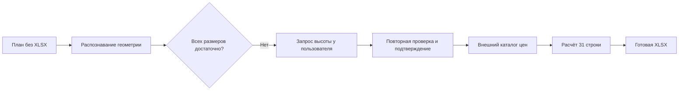

<strong>ТОЛЬКО ПЛАН → УТОЧНЕНИЕ РАЗМЕРОВ → ПОДТВЕРЖДЕНИЕ → ГОТОВАЯ XLSX</strong>

<h1>Предварительная смета только по плану</h1>

Фактический сквозной запуск Construction Audit MVP без исходной сметы: система распознала план медицинского офиса, запросила недостающую высоту, рассчитала объёмы работ и сформировала новую XLSX по внешнему каталогу цен.

Отсутствующие размеры не подставлялись автоматически, а файл был создан только после проверки геометрии и отдельного согласия пользователя.

<a href="https://michaeldavislol.github.io/construction_audit_mvp/demo/#plan-only-flow"><strong>▶ Посмотреть пошаговую демонстрацию</strong></a> · <a href="output/generated_estimate.xlsx"><strong>📊 Скачать готовую XLSX</strong></a> · <a href="output/generated_estimate.json"><strong>🔎 Проверить расчётные данные</strong></a>

| **1** исходный план | **5** помещений | **31** строка сметы | **0** пропущенных позиций |
|:---:|:---:|:---:|:---:|
| 164,36 м² | 7 видов работ | 6 дверей / 5 окон | 0 предупреждений |

> **Главное за минуту.** Пользователь передал только изображение плана. Система не стала угадывать отсутствующую высоту помещений, запросила её, пересчитала геометрию после ответа `2,8 м` и дождалась подтверждения. Затем она получила семь позиций внешнего каталога цен и сформировала предварительную смету на 31 строку без пропусков.

## Что получилось

| Раздел сметы | Контрольный объём | Как рассчитано |
|---|---:|---|
| Грунтовка стен | 295,08 м² | чистая площадь стен без дверных и оконных проёмов |
| Окраска стен | 295,08 м² | чистая площадь стен без дверных и оконных проёмов |
| Устройство пола | 164,36 м² | площадь пяти помещений |
| Отделка потолка | 164,36 м² | равна площади помещений |
| Монтаж плинтуса | 106,8 м | периметр за вычетом ширины дверных проёмов |
| Установка окон | 5 шт. | уникальные окна по плану |
| Установка дверей | 6 шт. | уникальные двери по всему объекту |

Каждая строка готовой XLSX содержит помещение, работу, единицу измерения, рассчитанное количество, цену внешнего каталога, стоимость и пояснение к расчёту. Структурированная версия с происхождением данных и контрольными хешами доступна в [`generated_estimate.json`](output/generated_estimate.json).

## Что было на входе

### Один план — без исходной XLSX

На плане распознаны пять помещений общей площадью `164,36 м²`, шесть уникальных дверей и пять окон. Высота стен на изображении не указана, поэтому первоначальных данных было недостаточно для расчёта отделочных работ.

**Исходный файл:** [`plan.png`](input/plan.png) · **Исходная смета:** отсутствует

## Ключевой момент: система не угадала высоту

| Этап | Что произошло |
|---|---|
| Распознавание | План был прочитан, но высота всех пяти помещений осталась неопределённой. |
| Безопасная остановка | Система не подставила «типовую» высоту и попросила пользователя дополнить данные. |
| Ответ пользователя | «Высота всех помещений 2.8 метра». |
| Пересчёт | Значение `2,8 м` применено к пяти помещениям, после чего площади стен рассчитаны заново. |
| Подтверждение | Пользователь повторно проверил обновлённые расчёты и отдельно подтвердил геометрию. |

Только после этого система запросила каталог цен и предложила создать XLSX. Это отделяет модельное распознавание плана от данных, которые действительно используются в расчётах.

## Как получен результат

1. План импортирован в отдельный запуск без создания фиктивной исходной сметы.
2. Vision распознал помещения, размеры, двери и окна.
3. Недостающая высота была явно запрошена у пользователя.
4. После ответа `2,8 м` система пересчитала геометрию и дождалась подтверждения.
5. Из внешнего `price-mcp` получены и проверены семь видов работ и соответствующие цены.
6. После отдельного согласия пользователя создана предварительная XLSX на 31 строку.

## Почему результат можно проверить

- **Отсутствующие данные не выдумываются.** Без высоты процесс остановился до расчёта площадей стен.
- **Геометрия подтверждена человеком.** В смету попали только объёмы, рассчитанные после повторной проверки пользователем.
- **Цены не берутся из памяти модели.** Семь позиций поступили из отдельного внешнего каталога MCP.
- **Проёмы дедуплицируются.** Межкомнатные двери могут относиться к двум помещениям, но в итоговой строке учитываются один раз.
- **Полнота показана явно.** Сформирована 31 строка; пропущенных позиций и предупреждений по количеству нет.
- **Распознавание плана имеет модельную вариативность.** При повторном запуске отдельные формулировки или распознанные детали могут немного отличаться, поскольку план анализирует Vision-модель. Поэтому система не продолжает расчёт без проверки и явного подтверждения геометрии пользователем.
- **Сохранена цепочка происхождения.** Версия геометрии, каталог цен, контрольные хеши и исходные значения записаны вместе с результатом.

## Открыть результат

| Для жюри и пользователя | Для независимой проверки | Для технического разбора |
|---|---|---|
| [**Скачать предварительную XLSX →**](output/generated_estimate.xlsx) | [**Открыть расчётные строки JSON →**](output/generated_estimate.json) | [**Все 6 артефактов →**](output/) |
| 31 строка по помещениям и видам работ | Объёмы, цены, стоимость, пояснения и хеши | Геометрия, исправление высоты, каталог и результат |

Короткая машиночитаемая сводка запуска: [`result-summary.json`](result-summary.json).

<strong>Как воспроизвести запуск</strong>

1. Установить скилл и запустить MCP по корневому [`INSTALL.md`](../../INSTALL.md).
2. В новом диалоге загрузить только [`plan.png`](input/plan.png).
3. Попросить сформировать предварительную смету по плану.
4. Проверить распознанную геометрию и сообщить: «Высота всех помещений 2.8 метра».
5. Повторно проверить обновлённые расчёты и отдельным сообщением подтвердить геометрию.
6. После получения каталога цен согласиться на создание XLSX-сметы.

<strong>Полная сводка запуска</strong>

| Метрика | Значение |
|---|---:|
| ID запуска | `plan_med_20260718` |
| Дата | 18 июля 2026 года |
| Режим | только план |
| Подтверждённая версия геометрии | 2 |
| Помещений | 5 |
| Площадь пола | 164,36 м² |
| Уникальных дверей / окон | 6 / 5 |
| Позиций каталога MCP | 7 |
| Строк в сформированной смете | 31 |
| Пропущено строк | 0 |
| Предупреждений по количеству | 0 |
| Выходных артефактов | 6 |

<strong>Состав технических артефактов</strong>

| Файл | Назначение |
|---|---|
| [`geometry.json`](output/geometry.json) | Подтверждённая геометрия пяти помещений |
| [`geometry_review.json`](output/geometry_review.json) | Структурированный обзор геометрии для пользователя |
| [`geometry_corrections.json`](output/geometry_corrections.json) | История добавления высоты `2,8 м` |
| [`price_catalog.json`](output/price_catalog.json) | Проверенный внешний каталог из семи работ |
| [`generated_estimate.json`](output/generated_estimate.json) | 31 строка сметы, полнота, хеши и происхождение данных |
| [`generated_estimate.xlsx`](output/generated_estimate.xlsx) | Готовая предварительная XLSX-смета |

---

> **Ограничение интерпретации.** Сформированная XLSX является предварительной расчётной сметой по подтверждённой геометрии и демонстрационному каталогу цен. Распознавание плана выполняется Vision-моделью и при повторном запуске может немного отличаться, поэтому геометрия всегда требует проверки пользователем. Результат не является проектной документацией или заключением строительного эксперта.

[← Вернуться на главную страницу проекта](../../README.md) · [Посмотреть полный аудит с исходной сметой и фотографиями →](../medical-office/README.md)
