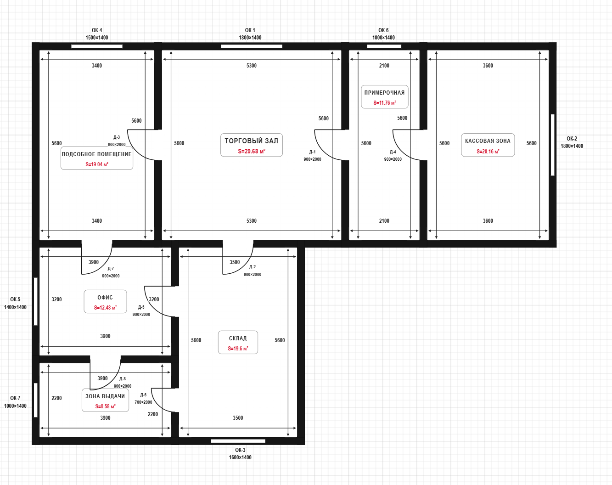

# Case 04: смета только по плану с явно указанными площадями

Фактический запуск `audit_shop_20260719` от 19 июля 2026 года, версия скилла `0.7.7`. На плане магазина явно подписаны площади всех семи помещений, но скилл не считает даже хорошо распознанную geometry автоматически подтверждённой.

**Коротко:** на чертеже уже были написаны площади всех помещений, и модель прочитала их правильно. Несмотря на это, скилл всё равно попросил человека проверить план и указать недостающую высоту. Только после подтверждения он получил цены и сформировал новую смету на 43 строки.

## Вход

- [`plan.png`](input/plan.png) — план магазина с семью помещениями и явными подписями площади;
- исходная XLSX-смета отсутствует: это ветка `plan_only`.

Vision сохранил для всех семи площадей `source_type: explicit_area_label`, включая evidence вроде `S=19.04 м²` и `S=29.68 м²`. Высота помещений отсутствовала в извлечённой geometry; пользователь явно сообщил: «Высота всех помещений 2.8 метра».

## Что произошло по шагам

1. `import_plan` сохранил единственный входной документ.
2. Vision извлёк семь помещений и явно подписанные на плане площади.
3. Скилл всё равно показал обязательный geometry review и запросил пользовательское подтверждение.
4. Явная correction высоты создала geometry revision 2; затем новая revision была снова показана пользователю.
5. В отдельном ходе пользователь подтвердил revision 2 через `confirm_geometry`.
6. Скилл вызвал `mcp_construction_prices__get_supported_works`, а `save_price_catalog` провалидировал и сохранил семь позиций.
7. Только после отдельного согласия пользователя deterministic-tool `generate_estimate` рассчитал количества и сформировал XLSX.

## Фактический результат

| Метрика | Значение |
|---|---:|
| Geometry revision | 2, подтверждена |
| Помещений / площадь пола | 7 / 121,30 м² |
| Площадей из явных подписей плана | 7 из 7 |
| Уникальных дверей / окон | 8 / 7 |
| Geometry warnings / missing / conflicts | 0 / 0 / 0 |
| Позиций каталога MCP | 7 |
| Строк generated estimate | 43 |
| Пропущено строк / quantity warnings | 0 / 0 |

Машиночитаемая сводка: [`result-summary.json`](result-summary.json). Готовая предварительная смета: [`generated_estimate.xlsx`](output/generated_estimate.xlsx).

## Что показывает кейс

Наличие площади на плане повышает качество evidence, но не отменяет обязательную пользовательскую границу. Скилл не перескакивает от Vision сразу к расчётам: сначала geometry должна быть показана, при необходимости исправлена и отдельно подтверждена.

После подтверждения оркестратор вызывает предусмотренные workflow tools, а количества, цены и итоговые стоимости формируются deterministic-кодом по зафиксированной geometry и каталогу MCP. Модель не рассчитывает смету самостоятельно и не подменяет отсутствующие данные предположениями.

В [`output/`](output/) находятся все шесть файлов фактического output-каталога: geometry, review, история correction, каталог MCP и generated estimate в JSON/XLSX.
