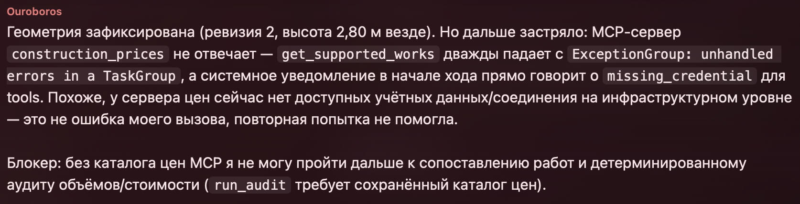

# Сценарий 07: сервис цен недоступен — безопасная остановка

Фактический запуск `audit_office_20260719` от 19 июля 2026 года, версия скилла `0.7.7`. Во время запуска обязательный MCP-сервер `construction_prices` был намеренно недоступен. Ожидаемый результат — остановить процесс после подтверждения геометрии, не подставлять цены из памяти модели и не создавать частичную проверку или отчёт.

**Коротко:** внешний сервис с перечнем работ и цен специально отключили. Скилл дважды попытался получить данные, затем ясно сообщил о проблеме и безопасно остановился. Он не придумал цены и не выдал незавершённую проверку за готовый результат.

## Вход

- [`plan.png`](input/plan.png) — план офиса из пяти помещений;
- [`estimate.xlsx`](input/estimate.xlsx) — исходная смета на 35 строк.

## Что успело завершиться

1. План и XLSX были импортированы и сохранены.
2. Vision извлёк пять помещений.
3. Пользователь явно указал высоту всех помещений `2,8 м`; исправление создало версию геометрии 2.
4. Revision 2 была повторно показана и отдельно подтверждена пользователем.
5. После `confirm_geometry` оркестратор попытался получить обязательный каталог цен MCP.

Manifest фиксирует `geometry_confirmed: true` и `geometry_confirmed_revision: 2`. Geometry review не содержит missing fields или conflicts.

## Доказательство недоступности сервиса цен

Сообщение фиксирует:

- две неуспешные попытки `get_supported_works`;
- ошибку `ExceptionGroup: unhandled errors in a TaskGroup`;
- системное уведомление `missing_credential` для tools;
- явный блокер: без каталога цен нельзя переходить к Mapping и `run_audit`.

Скриншот подтверждает причину остановки, а состояние job — отсутствие побочных результатов после ошибки.

## Фактический результат

| Метрика | Значение |
|---|---:|
| Версия геометрии | 2, подтверждена |
| Помещений / площадь пола | 5 / 98,38 м² |
| Уникальных дверей / окон | 6 / 5 |
| Строк импортированной сметы | 35 |
| Попыток MCP на скриншоте | 2 |
| Price catalog | не создан |
| Сопоставление / детерминированная проверка | не запускались |
| Расхождения / отчёт | не создавались |
| Manifest audit status | `not_started` |
| Итог кейса | `blocked_external_dependency` |

Машиночитаемая сводка: [`result-summary.json`](result-summary.json).

## Что показывает кейс

Скилл безопасно прекращает работу при недоступности обязательного источника. Даже после полностью подтверждённой геометрии он не использует цены из памяти LLM. Повторная попытка получить данные через MCP не помогла, поэтому процесс сообщил о блокирующей проблеме и сохранил только уже завершённые этапы.

Отсутствие `price_catalog.json`, Mapping, quantities, calculation trace, price checks, findings и `report.html` является ожидаемым результатом этого теста, а не потерей артефактов.

В [`output/`](output/) находятся все четыре фактически созданных файла: нормализованная смета, версия геометрии 2, история исправлений и обзор геометрии.
