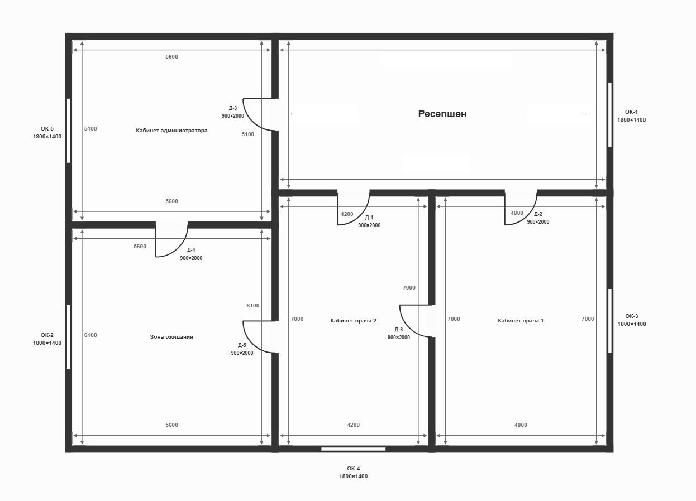

# Сценарий 08: стёртые размеры помещения и исправление пользователя

Фактический запуск `audit_med2_20260719` от 19 июля 2026 года, версия скилла `0.7.7`. На плане намеренно стёрты линейные размеры помещения «Ресепшен». Ожидаемый результат — Vision не должен восстанавливать невидимые значения по масштабу или типовым предположениям; процесс обязан запросить недостающие размеры, принять явное исправление пользователя и выполнить расчёты только по новой подтверждённой версии геометрии.

**Коротко:** размеры одного помещения специально удалили с чертежа. Скилл не стал их угадывать, запросил длину и ширину у пользователя, пересчитал площадь, стены и плинтус и затем проверил все 35 строк сметы без расхождений.

## Вход

- [`plan.png`](input/plan.png) — изменённый план медицинского офиса: размерные подписи «Ресепшен» закрыты белыми прямоугольниками;
- [`estimate.xlsx`](input/estimate.xlsx) — корректная смета на 35 строк.

Приложенный пользователем к evidence-кейсу план побайтово совпадает с фактическим job input: SHA-256 `45f4858d2d534c538926d5d7af282ccca0f0cc560bd8e9d236bfd787a9c695ff`.

## Что произошло по шагам

1. Vision распознал пять помещений, двери и окна, но отметил замаскированные размерные подписи в верхней части «Ресепшен».
2. Geometry review не подставил отсутствующие размеры самостоятельно и запросил их у пользователя.
3. Пользователь сообщил: «Ресепшн размеры ширина 4.2 длина 9.2. Высота всех помещений 2.8 метра».
4. `confirm_geometry(... confirmed=false)` применил ограниченные исправления к `room_002.width_m`, `room_002.length_m` и высоте всех помещений и создал версию 2.
5. Детерминированный код пересчитал зависимые поля «Ресепшен»: площадь `38,64 м²` и периметр `26,8 м`.
6. Revision 2 была снова показана и отдельно подтверждена пользователем.
7. После подтверждения скилл получил каталог MCP, выполнил детерминированную проверку и сформировал отчёт.

## Расчёты по введённым размерам

| Метрика «Ресепшен» | Формула | Результат |
|---|---|---:|
| Площадь пола | `9,2 × 4,2` | 38,64 м² |
| Периметр | `2 × (9,2 + 4,2)` | 26,8 м |
| Площадь стен до проёмов | `26,8 × 2,8` | 75,04 м² |
| Площадь проёмов | двери `5,40` + окно `2,52` | 7,92 м² |
| Чистая площадь стен | `75,04 − 7,92` | 67,12 м² |
| Длина плинтуса | `26,8 − 0,9 − 0,9 − 0,9` | 24,10 м |

В [`geometry.json`](output/geometry.json) длина и ширина имеют `source_type: user_correction`, а площадь и периметр — `source_type: derived_from_explicit_dimensions`. Полные формулы и последующие проверки объёмов сохранены в [`calculation_trace.json`](output/calculation_trace.json).

## Фактический результат

| Метрика | Значение |
|---|---:|
| Версия геометрии | 2, подтверждена |
| Исправления геометрии | 1 событие, 3 изменения |
| Помещений / площадь пола | 5 / 164,36 м² |
| Уникальных дверей / окон | 6 / 5 |
| Пропущенные поля / конфликты после исправления | 0 / 0 |
| Строк сметы | 35 |
| Полнота проверки объёмов / цен | 100% / 100% |
| Точные совпадения количества | 35 |
| Quantity / price deviations | 0 / 0 |
| Расхождения | 0 |
| Analyst status | `no_useful_observations` |

Машиночитаемая сводка: [`result-summary.json`](result-summary.json). Полный пользовательский результат: [`report.html`](output/report.html).

## Что показывает кейс

Скилл сохраняет происхождение каждого значения и не смешивает Vision с пользовательскими данными. Невидимые размеры не были угаданы; введённые пользователем `9,2 × 4,2 м` стали явным источником версии 2, а все зависимые величины и проверки были рассчитаны Python-кодом уже после отдельного подтверждения.

Нулевые findings являются ожидаемым результатом: смета была подготовлена по тем же корректным размерам. Кейс доказывает не обнаружение ошибки в смете, а устойчивое восстановление недостающей расчётной базы без скрытых предположений.

В [`output/`](output/) находятся все 14 файлов фактического output-каталога.
