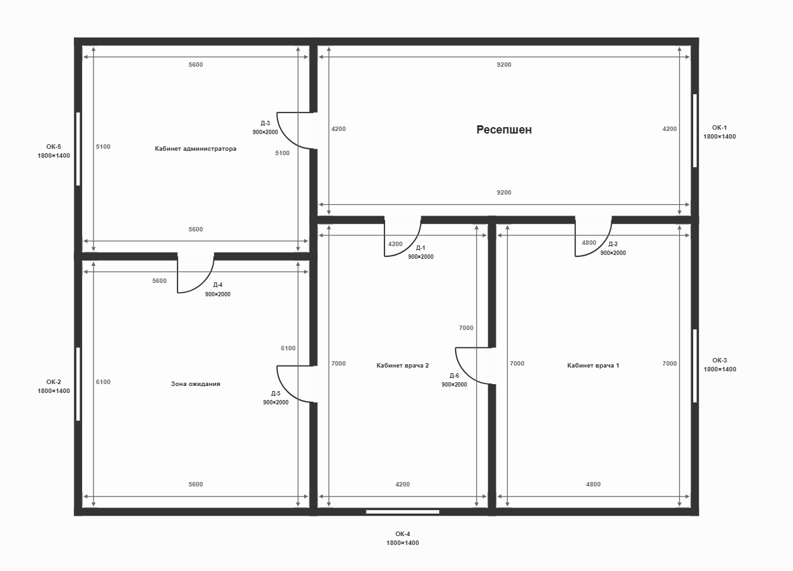

# Сценарий 09: помещение есть на плане, но отсутствует в смете

Фактический запуск `audit_medoffice_20260719` от 19 июля 2026 года, версия скилла `0.7.7`. Перед запуском из исходной сметы намеренно удалены все строки помещения «Кабинет администратора», хотя помещение осталось на плане. Вместе с ним исчезла относящаяся к нему строка установки двери.

**Коротко:** целое помещение удалили из сметы, но оставили на плане. Скилл независимо увидел его на чертеже, не добавил вымышленные строки во время проверки исходной сметы и обнаружил, что в смете не учтена установка одной двери. Когда пользователь отдельно попросил новую смету, помещение было восстановлено в ней по данным плана и внешнему справочнику цен.

Ожидаемый результат состоит из трёх независимых частей:

1. Plan Vision должен распознать все помещения по плану и не подгонять геометрию под состав XLSX.
2. Аудит исходной сметы не должен создавать вымышленные строки отсутствующего помещения.
3. Отдельно запрошенная контрольная смета должна использовать всю подтверждённую геометрию и вернуть пропущенное помещение.

## Вход

- [`plan.png`](input/plan.png) — план медицинского офиса с пятью помещениями;
- [`estimate.xlsx`](input/estimate.xlsx) — смета на 28 строк только для четырёх помещений.

## Помещение независимо распознано на плане

Vision распознал и сохранил все пять помещений:

| Помещение на плане | Площадь | Есть в исходной XLSX |
|---|---:|---:|
| Кабинет администратора | 28,56 м² | нет |
| Ресепшен | 38,64 м² | да |
| Зона ожидания | 34,16 м² | да |
| Кабинет врача 2 | 29,40 м² | да |
| Кабинет врача 1 | 33,60 м² | да |

`Кабинет администратора` имеет собственный `room_001`, размеры, две двери `Д-3`/`Д-4` и окно `ОК-5`. Это показывает, что Vision работал по изображению плана, а не выводил список помещений из сметы.

## Что вошло в проверку исходной сметы

Нормализованная XLSX содержит только четыре названия помещений. Этап сопоставления связал четыре помещения и не создавал искусственного соответствия или строки для отсутствующего кабинета. Все 28 фактических строк сметы были проверены; полнота проверки составила `100%`.

В пользовательских таблицах количества, цены и стоимости нет выдуманных строк «Кабинета администратора». При этом HTML корректно сохраняет помещение в разделах **Геометрия объекта** и **Calculation trace**, потому что эти разделы описывают подтверждённый план, а не строки исходной XLSX.

Это различие принципиально: помещение сохраняется в данных о происхождении результата, но не выдаётся за позицию, которая якобы была в исходной смете.

## Найденное расхождение дверей

В исходной смете суммарно учтено `5` установок дверей, тогда как подтверждённая геометрия содержит `6` уникальных проёмов. Детерминированная проверка создала одно общее расхождение:

| Показатель | Значение |
|---|---:|
| Область проверки | `object_total_unique_doors` |
| Дверей в смете | 5 |
| Уникальных дверей на плане | 6 |
| Отклонение | 1 шт. / 16,67% |
| Важность | предупреждение |
| Расчётный эффект | 7 000 |

Известная причина теста — удаление кабинета вместе с дверной строкой. Сам finding намеренно остаётся объектным и не приписывает недостающую установку конкретному помещению без отдельного доказательства распределения. Analyst сформулировал возможный пропуск помещения как гипотезу и сохранил это ограничение.

## Контрольная смета возвращает помещение

После отчёта пользователь отдельно запросил контрольную XLSX. `generate_estimate` использовал не состав исходной сметы, а подтверждённую геометрию и цены MCP. В [`generated_estimate.xlsx`](output/generated_estimate.xlsx) появились:

- шесть рассчитанных строк «Кабинета администратора»;
- площадь пола и потолка `28,56 м²`;
- чистая площадь стен `53,8 м²`;
- длина плинтуса `19,6 м`;
- одно окно;
- объектная строка установки `6` уникальных дверей по цене `7 000`, итого `42 000`.

Контрольная смета содержит 31 строку без пропусков. Это независимый результат, рассчитанный по геометрии и каталогу MCP, а не исправленная копия исходной XLSX.

## Фактический результат

| Метрика | Значение |
|---|---:|
| Версия геометрии | 2, подтверждена |
| Помещений на плане / в исходной смете | 5 / 4 |
| Строк исходной сметы | 28 |
| Полнота проверки объёмов / цен | 100% / 100% |
| Расхождения | 1 предупреждение |
| Дверей в смете / на плане | 5 / 6 |
| Гипотезы аналитического этапа | 2 |
| Строк контрольной сметы | 31 |
| Помещений в контрольной смете | 5 |
| Пропущено строк при формировании сметы | 0 |

Машиночитаемая сводка: [`result-summary.json`](result-summary.json). Полный пользовательский результат: [`report.html`](output/report.html).

В [`output/`](output/) находятся все 16 файлов фактического каталога результатов.
